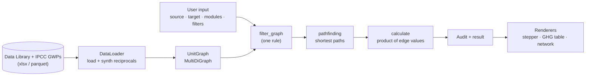
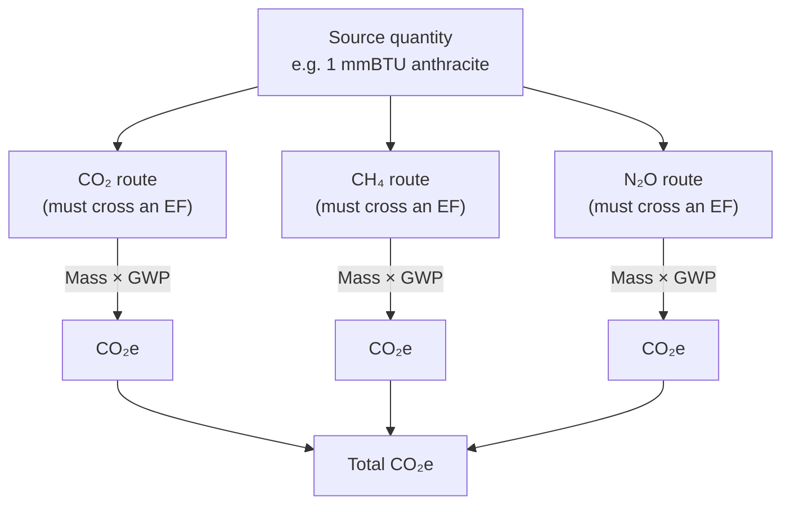
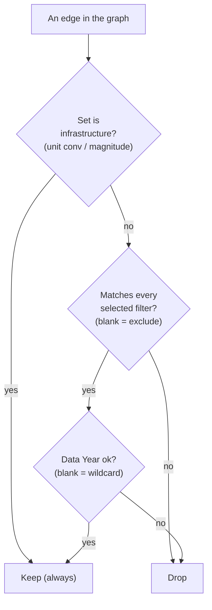

# Diagrams

Mermaid diagrams of how UnitGPS works (render in GitHub and Obsidian). Companion to
[[METHODOLOGY]] and [[architecture]].

## End-to-end data flow

## GHG accounting (per result)

## The one filter rule

